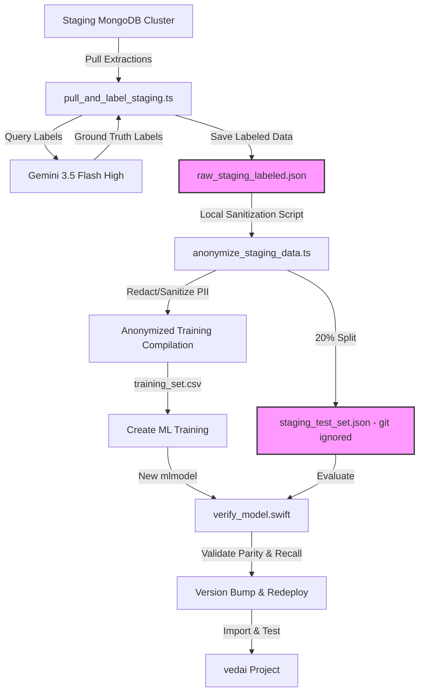

# Specification: Edge Classifier Retraining

## Overview
The **PrivacyGatekeeper** classifier is currently overly sensitive, leading to high false-positive rates where digestible narrative articles are blocked as sensitive portals. To resolve this, we will retrieve real-world data pre-processed in Markdown from our staging database (`raw_staging_extractions` collection in the MongoDB staging cluster), label it using Gemini 3.5 Flash High as the ground truth, and incorporate it into our training pipeline. A subset of this staging data will be held out as a dedicated "real test set" to verify performance improvements before updating and redeploying the library.

> [!IMPORTANT]
> **Data Privacy & Leak Prevention Mandate:**
> Because the staging extractions contain real-world user browsing history, they may contain sensitive PII (auth tokens, personal emails, sessions, private data). To prevent accidental leakage to the public `gate` repository, all raw staging downloads and the staging test set MUST be strictly excluded from Git. Additionally, any data merged into the persistent repository training set must be sanitized, redacted, or transformed into anonymous structural token sequences.

## Objectives
1. **Enforce Local Data Isolation:** Update `.gitignore` to prevent any staging extractions or test sets from being committed.
2. **Pull Production Data:** Connect to the `vedai` staging MongoDB cluster and pull all raw staging extractions (~100 records) to local scratch files.
3. **LLM Ground Truth Labeling:** Use Gemini 3.5 Flash (High) to analyze each extraction and assign a high-fidelity label (`sensitive_portal`, `digestible_article`, or `noise`).
4. **PII Auditing & Anonymization:** Implement a local utility script to sanitize the data, stripping any personal content (emails, API keys, names) and retaining only structural tokens and anonymized/redacted text.
5. **Data Splitting & Curation:** Hold back 20% of the staging data locally as a dedicated real-world test set. Merge the sanitized 80% split into the training set.
6. **Retrain Classifier:** Run the Create ML training pipeline to compile a new `.mlmodel` substrate.
7. **Verify Performance:** Run verification on the general validation set and the local staging test set.
8. **Increment & Redeploy:** Bump the library version, build bundles, and publish.
9. **Downstream Integration:** Update the `@alete-ai/gate-ingest` dependency in the `vedai` workspace and verify the improved classification hit rate.

## Architectural Blueprint

## Functional Requirements
- **Git Exclusion:** Add git-ignore rules for `data/raw_staging_*.json` and `data/staging_test_set.json`.
- **Database Connector:** Establish a connection to `vedai-cluster-staging.952n7om.mongodb.net/vedai_db` using credentials from `.env.staging` in the `vedai` workspace.
- **LLM Ground Truth Labeler:** Call the Vertex AI / Gemini API to classify content (title + structural markdown + semantic markdown) using Gemini 3.5 Flash High.
- **PII Sanitizer & Anonymizer:** Audit extractions using Regex or heuristic patterns to identify and redact email addresses, names, tokens, credentials, and custom keys.
- **Data Curation & Compilation:** Write a curation script to combine existing training data with the sanitized staging data (80% training / 20% testing split).
- **Model Training:** Retrain `PrivacyGatekeeper` using Create ML's Maximum Entropy algorithm.
- **Verification Harness:** Evaluate performance metrics:
  - Accuracy & Average Latency (Target: Accuracy >97%, Latency <1ms).
  - Survival Recall on `sensitive_portal` (Target: 100.00% recall).
  - digestible_article Recall (Target: minimize false positives).
- **Versioning & Release:** Bump package version in `package.json` and Swift Package manifest, and publish.

## Non-Functional Requirements
- **Sub-Megabyte Footprint:** The compiled `.mlmodel` must remain under 1MB.
- **Privacy Preservation:** No PII or raw staging credentials should be committed to version control.
