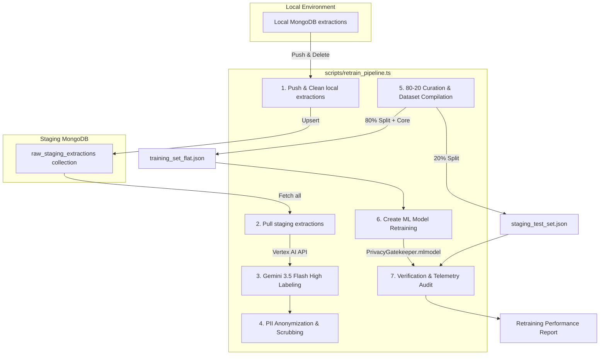

# Specification: Edge Classifier Retraining CLI Action

## Overview
We need to streamline and automate the edge classifier retraining process. In Track 002, we executed several separate scripts sequentially to pull data, label it, anonymize it, partition it, retrain the model, and verify it. We will unify this process into a single, cohesive CLI command/action (`pnpm run retrain-pipeline` or `scripts/retrain_pipeline.ts`) in the `gate` workspace. This will allow developers to trigger the entire retraining loop seamlessly as new data is collected in staging.

## Objectives
1. **Unify the Retraining Pipeline:** Combine all steps from Track 002 (Pushing local extractions, Pulling staging data, Gemini labeling, Anonymization, Partitioning/Compilation, Create ML Retraining, and Verification) into a single, automated orchestrator script.
2. **Local-to-Staging Synchronization:** Enable automatic push of local raw staging extractions to the staging database and deletion of local records as part of the pipeline.
3. **Robust Curation & Holdout:** Enforce a strict 20% holdout split from the newly acquired staging data to be used exclusively for real-world test evaluation.
4. **Environment Isolation & Safety:** Ensure the pipeline only writes to the staging cluster (never production) and strictly git-ignores raw downloads, labels, and local test sets to prevent PII leaks.

## Architectural Blueprint

## Functional Requirements
- **Unified CLI Command:** Add a package script `"db:retrain-pipeline": "ts-node --transpile-only -r tsconfig-paths/register scripts/retrain_pipeline.ts"` in `gate/package.json`.
- **Pipeline Stages:**
  1. **Sync Local Extractions:** If local MongoDB has extractions, push them to the staging MongoDB cluster and delete them locally (similar to `@vedai/analysis-service db:push-staging-articles`).
  2. **Pull Staging Dataset:** Fetch all extractions from the MongoDB staging cluster `raw_staging_extractions` collection and save them to `data/raw_staging_extractions.json`.
  3. **Gemini Labeling:** Query the Vertex AI / Gemini API to assign ground truth labels (`sensitive_portal`, `digestible_article`, `noise`) using Gemini 3.5 Flash (High).
  4. **PII Sanitizer:** Anonymize the text content (emails, credentials, tokens, personal names) and preserve structural layout tokens, saving to `data/raw_staging_anonymized.json`.
  5. **Data Split & Merge:** Deterministically partition the sanitized data: 20% to `data/staging_test_set.json` (git-ignored) and 80% to be merged with the core training dataset (`data/processed/training_set.json`), generating the final flat JSON and CSV training inputs.
  6. **Create ML Training:** Invoke `train_model.swift` to train the new classifier.
  7. **Model Verification:** Run `verify_model.swift` to evaluate the new model against both the general validation set and the new `staging_test_set.json`.
- **CLI Options & Flags:**
  - `--skip-push`: Skips pushing local MongoDB extractions to staging.
  - `--skip-labeling`: Skip calling Gemini labeling if labeled file `raw_staging_labeled.json` already exists.
  - `--dry-run`: Log planned actions without committing writes or starting training.
  - `--silent`: Suppress verbose logs, showing only a final summary.

## Non-Functional Requirements
- **Leak Prevention:** Ensure all raw downloaded data, temporary labels, and test sets are git-ignored.
- **Fail-Fast Mechanics:** The orchestrator must immediately halt if any stage fails (e.g., connection failures, labeling errors, compilation failures) and report the exact cause.
