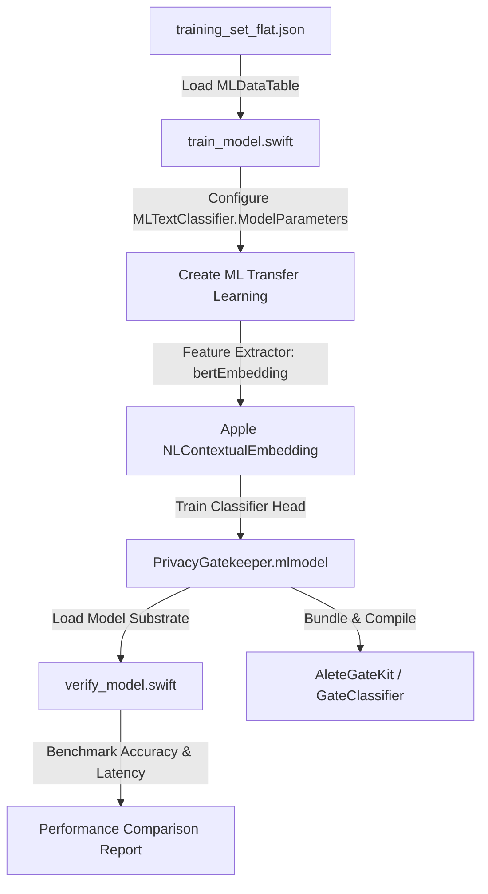

# Specification: NL Contextual Embedding Classifier

## Overview
The goal of this track is to upgrade the **PrivacyGatekeeper** classifier from a Maximum Entropy (MaxEnt) bag-of-words model to an Apple native transformer-based text classifier using **`NLContextualEmbedding`** (via Create ML `.transferLearning` with `.bertEmbedding`). 

This change aims to address the accuracy limitations of the current model (currently at 86.89% holdout test set accuracy) by leveraging pre-trained contextual embeddings from the OS. This allows the model to understand sentence structure, semantic meaning, and sequence order, drastically reducing false-positive rates when classifying browser-extracted content.

## Objectives
1. **Upgrade the Training Pipeline:** Modify the training script to configure `MLTextClassifier` to use the `.transferLearning` algorithm with `.bertEmbedding`.
2. **Train the Transformer Substrate:** Train the updated model on the existing 4-class target space dataset (`deep_work`, `informational`, `communication`, `noise`).
3. **Verify Generalization & Accuracy:** Verify performance on the holdout test set to ensure accuracy exceeds the target of **91%+** (up from 86.89%).
4. **Benchmark Inference Latency:** Measure average on-device inference execution times on Apple Silicon to verify it fits the browser extension latency budget (<40ms average classification latency).
5. **Ensure Backwards Compatibility:** Ensure the generated model continues to load and run seamlessly via the Swift Natural Language framework in [GateClassifier.swift](file:///Users/stoyan/git/gate/ios/AleteGateKit/Sources/AleteGateKit/GateClassifier.swift) and passes all SPM unit tests.

## Architectural Blueprint


## Functional Requirements
- **Training Algorithm Configuration:** Specify transfer learning parameters when initializing the classifier:
  ```swift
  let parameters = MLTextClassifier.ModelParameters(
      algorithm: .transferLearning(revision: 1),
      featureExtractor: .bertEmbedding
  )
  ```
- **Asset Warmup & Loading:** Modify [GateClassifier.swift](file:///Users/stoyan/git/gate/ios/AleteGateKit/Sources/AleteGateKit/GateClassifier.swift) to ensure proper loading, and implement an optional warmup routine to avoid first-call latency spikes.
- **Evaluation and Comparison:** Update [verify_model.swift](file:///Users/stoyan/git/gate/scripts/verify_model.swift) or write a comparison script to load both the MaxEnt baseline and the new transfer-learned model, running back-to-back evaluations on the holdout test set.
- **Metrics Dashboard:** Report:
  - Accuracy, Precision, Recall, and F1-score for each of the 4 cognitive classes.
  - Mean, P90, and P99 inference latency in milliseconds.
  - Compiled model size comparison.

## Non-Functional Requirements
- **Minimal Bundle Impact:** The compiled model size should remain small (typically < 3MB) because embedding weights are built directly into iOS 17+/macOS 14+ systems.
- **No Tokenization Overhead:** Utilize the Apple Natural Language framework to perform tokenization automatically, avoiding shipping third-party tokenization code or vocabulary tables.
