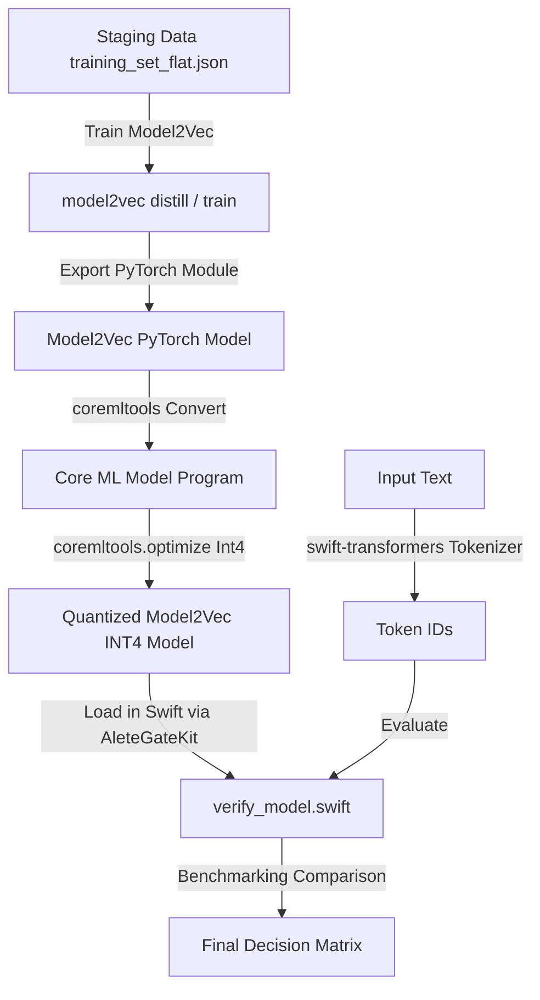

# Specification: Model2Vec INT4 Classifier

## Overview
Model2Vec is a framework for distilling Sentence Transformer models into extremely compact, fast static word/sentence embedding models. Unlike full transformers, Model2Vec represents sentences by looking up static word embeddings, applying mean pooling, and running a simple classifier head. This eliminates attention weights and heavy multi-layer forward passes.

This track specifies the implementation of a Model2Vec text classifier on the Alete-Gate 4-class target space (`deep_work`, `informational`, `communication`, `noise`). The model will be exported to PyTorch, converted to Core ML, compressed to 4-bit (INT4) weight precision using `coremltools`, and compared back-to-back with the legacy MaxEnt model and the recently trained `NLContextualEmbedding` model.

## Objectives
1. **Train Model2Vec Classifier:** Establish a Python training pipeline utilizing the `model2vec` library. Distill or fine-tune a lightweight static representation and train a logistic regression or classification head.
2. **Convert to Core ML:** Express the Model2Vec model as a PyTorch module (composed of `nn.Embedding`, mean pooling, and `nn.Linear` classifier head) and convert it to Core ML (`.mlpackage`).
3. **4-Bit weight Compression (INT4):** Compress the model's embedding matrix and classifier weights to 4-bit precision using `coremltools.optimize` post-training quantization or palettization.
4. **Swift Tokenization & Integration:** Integrate Hugging Face's `swift-transformers` library into the Swift package [AleteGateKit](file:///Users/stoyan/git/gate/ios/AleteGateKit) to handle subword tokenization mapping (WordPiece or BPE) in Swift.
5. **Back-to-Back Benchmarking:** Run comparative validation on the staging holdout test set to analyze accuracy, size, and latency percentiles (P50/P90/P99).

## Architectural Blueprint

## Functional Requirements
- **Python Pipeline (`scripts/train_model2vec.py`):**
  - Load training dataset `data/processed/training_set_flat.json`.
  - Use `model2vec` library to distill a base model (e.g., `minishlab/potion-base-8M`).
  - Train a classification head on top of the distilled static representations.
  - Export PyTorch weights (embedding layer + linear classifier weights and biases).
- **Core ML Conversion Script (`scripts/convert_model2vec.py`):**
  - Implement a PyTorch module mirroring Model2Vec classification inference.
  - Convert to Core ML format.
  - Apply `coremltools.optimize.coreml` linear weight quantization to `int4` precision target.
  - Save as `models/Model2VecGatekeeper.mlmodel`.
- **Swift Integration:**
  - Update `Package.swift` in `ios/AleteGateKit` to depend on Hugging Face's `swift-transformers` library.
  - Wrap vocabulary loading and tokenization mapping in Swift.
- **Verification & Benchmarking:**
  - Update [verify_model.swift](file:///Users/stoyan/git/gate/scripts/verify_model.swift) to load the new `Model2VecGatekeeper.mlmodel` and run tokenized text samples through it.
  - Record and report accuracy and latency (Avg, P50, P90, P99).

## Non-Functional Requirements
- **Ultra-Low Latency:** Inference latency must target sub-2ms (aiming close to MaxEnt speeds).
- **Quantized Footprint:** Compressed model size must remain under **5 MB** using INT4 weights.
