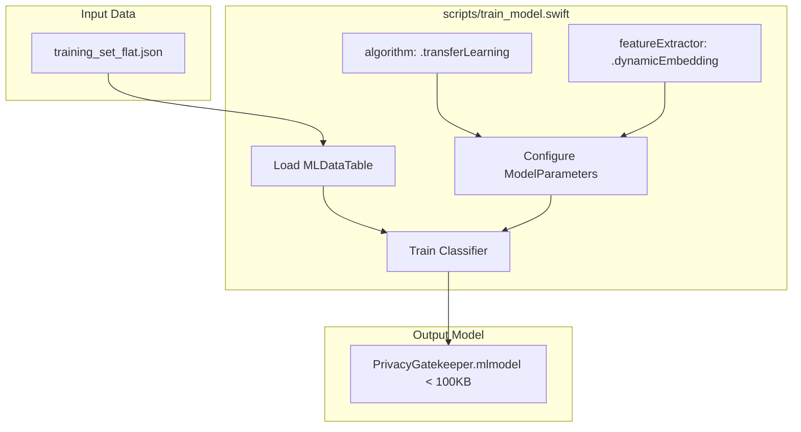

# Specification: Transfer Learning Classifier Upgrade (v1.0.0)

## Overview
We need to upgrade our local edge-based text classifier (`PrivacyGatekeeper.mlmodel`) from a bag-of-words Maximum Entropy (`.maxEnt`) algorithm to a **Transfer Learning (`.transferLearning`)** algorithm in Create ML. This will leverage pre-trained contextual word/sentence embeddings built directly into the Apple operating system (iOS/macOS), allowing the model to capture semantic meaning and greatly improve classification accuracy.

This release will target version **`1.0.0`** of our library.

## Objectives
1. **Improve Accuracy**: Increase the edge classifier's generalization accuracy on real-world staging data beyond the current 90.09% baseline.
2. **Dynamic Embedded Feature Extraction**: Configure the model to use the OS-provided dynamic shared text embeddings (`.dynamicEmbedding` or `.bertEmbedding` in Create ML), ensuring that the `.mlmodel` package size stays extremely small (< 100 KB) and avoids bundling heavy static embedding weights.
3. **OS Compatibility Alignment**: Align the iOS and macOS client deployment targets to support transfer learning text classifiers (requires iOS 15.0+ / macOS 12.0+).
4. **Maintain Performance**: Maintain low inference latencies (< 5 ms per document) during on-device execution.

## Architectural Blueprint

## Functional Requirements
- **Create ML Parameters**:
  - Update `scripts/train_model.swift` to initialize `MLTextClassifier.ModelParameters` with `.transferLearning(.dynamicEmbedding, revision: 1)`.
  - Pass the parameters instance during `MLTextClassifier` instantiation.
- **Model Metadata Versioning**: Set the version parameter inside `MLModelMetadata` in `train_model.swift` to `"1.0.0"`.
- **Package Version Bumps**: Prepare to bump version to `1.0.0` in both root `package.json` and package manifests.
- **Verification & Telemetry Evaluation**: Use `scripts/verify_model.swift` to compare the accuracy and latency of the transfer learning model against the MaxEnt v0.3.3 baseline on the 111-record staging holdout test set.

## Non-Functional Requirements
- **Zero-Payload Size Constraint**: The exported `.mlmodel` file must be under **100 KB** (relying on OS-shared embeddings).
- **Execution Latency Constraint**: Inference latency on Apple Neural Engine / CPU must remain under **5 ms** on average per document.
- **Compatibility Constraint**: The app must declare support for iOS 15.0+ / macOS 12.0+ to load the transfer learning model safely.
